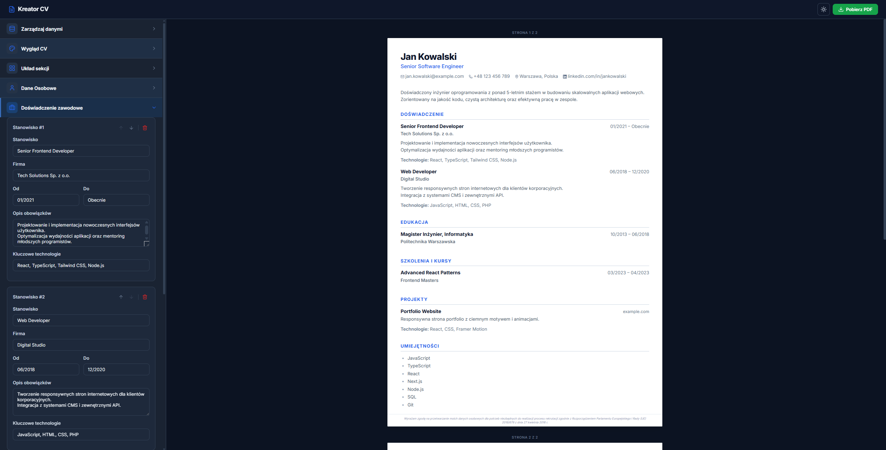

# 📄 Kreator CV – Nowoczesny Generator Życiorysów

> 🇵🇱 Polish (default) · [🇬🇧 English version below](#-cv-creator--modern-resume-generator)



**Kreator CV** to zaawansowana aplikacja webowa stworzona w celu ułatwienia procesu tworzenia profesjonalnych, estetycznych i skutecznych życiorysów. Dzięki intuicyjnemu edytorowi i podglądowi na żywo użytkownik może w kilka minut przygotować dokument gotowy do wysłania rekruterowi.

---

## 🚀 Główne Funkcje

### ✏️ Edytor i Podgląd
- **Edytor na żywo** – Wprowadzaj zmiany i obserwuj natychmiastowe odzwierciedlenie w podglądzie dokumentu.
- **Wielostronicowe CV** – Automatyczna paginacja z poprawnym renderowaniem marginesów na każdej stronie.
- **Motyw Dark / Light** – Przełączaj się między ciemnym a jasnym widokiem edytora.

### 🎨 Personalizacja Wyglądu
- **5 szablonów CV** do wyboru:
  - **Klasyczny** – Elegancki, jednokolumnowy układ.
  - **Nowoczesny** – Dwukolumnowy układ z wydzieloną sekcją kontaktów.
  - **Minimalistyczny** – Przejrzysty styl bez zbędnych ozdobników.
  - **Kompaktowy** – Zoptymalizowany pod kątem oszczędności miejsca.
  - **Kreatywny** – Dwukolumnowy z kolorowym nagłówkiem osobowym.
- **Kolor akcentujący** – Wybierz spośród predefiniowanych kolorów lub użyj własnego (color picker).
- **Kolor tła nagłówka** – Dedykowana opcja dla szablonu Kreatywnego.
- **Typografia** – Pełna integracja z Google Fonts (Inter, Merriweather, Roboto, Open Sans, Montserrat, Lato, Playfair Display).
- **Skalowanie czcionki** – Niezależna regulacja rozmiaru nagłówków i tekstu (80–130%).
- **Ikony sekcji** – Opcjonalne ikony przy nagłówkach sekcji w dokumencie.
- **Ikony danych kontaktowych** – Opcjonalne ikony (email, telefon, lokalizacja itp.).
- **Marginesy dokumentu** – Presety (małe / normalne / duże) oraz tryb własny (0–50 mm osobno dla każdej krawędzi).

### 🖼️ Zdjęcie Profilowe
- Obsługa przesyłania zdjęcia (z podglądem).
- Wybór kształtu: **koło**, **zaokrąglony kwadrat**, **prostokąt**.
- Regulacja rozmiaru zdjęcia.

### 📋 Rozbudowane Sekcje CV
Aplikacja obsługuje kompleksowy zestaw sekcji:

| Sekcja | Opis |
|--------|------|
| **Dane osobowe** | Imię, nazwisko, stanowisko, kontakt, zdjęcie |
| **Doświadczenie zawodowe** | Firma, wiele stanowisk (awanse wewnętrzne), zakres dat, opis |
| **Edukacja** | Uczelnia, kierunek, zakres dat |
| **Projekty** | Nazwa, opis, technologie |
| **Kursy i szkolenia** | Nazwa kursu, organizator, daty |
| **Certyfikaty** | Nazwa certyfikatu, wydawca, data |
| **Publikacje** | Tytuł, wydawca, data |
| **Języki** | Język i poziom zaawansowania |
| **Umiejętności** | Lista umiejętności technicznych i miękkich |
| **Zainteresowania** | Hobby i zainteresowania |
| **Wolontariat** | Organizacja, rola, opis, daty |
| **Referencje** | Imię, firma, kontakt |
| **Sekcja własna** | Dowolna treść zdefiniowana przez użytkownika |
| **Klauzula RODO** | Konfigurowalna klauzula ochrony danych |

### 📤 Eksport i Import Danych
- **Eksport do PDF** – Zoptymalizowany druk w formacie A4 (bez nagłówków i stopek przeglądarki).
- **Eksport JSON** – Zapisz wszystkie dane CV do pliku.
- **Import JSON** – Wczytaj i kontynuuj edycję zapisanego CV.

### 🌍 Dwujęzyczność
- Możliwość przełączenia języka dokumentu między **polskim** a **angielskim** (etykiety sekcji, daty itp.).

---

## 🛠️ Stos Technologiczny

| Technologia | Zastosowanie |
|-------------|-------------|
| **React 19** | Główny framework UI |
| **TypeScript** | Typowanie statyczne |
| **Vite** | Błyskawiczne środowisko deweloperskie |
| **CSS3 (Vanilla)** | Custom properties, dynamiczny motyw, layout |
| **Lucide React** | Elegancki zestaw ikon SVG |
| **Google Fonts** | Integracja z popularnymi krojami pisma |
| **AI Assisted** | Rozwijany przy wsparciu modeli Claude i Gemini |

---

## ⚙️ Szybki Start

1. **Sklonuj repozytorium:**
   ```bash
   git clone https://github.com/TwojUser/app_cv.git
   cd app_cv
   ```

2. **Zainstaluj zależności:**
   ```bash
   npm install
   ```

3. **Uruchom serwer deweloperski:**
   ```bash
   npm run dev
   ```

Aplikacja będzie dostępna pod adresem `http://localhost:5173`.

---

## 📁 Struktura Projektu

```
src/
├── components/
│   ├── Editor/
│   │   ├── panels/          # Panele edytora (dane osobowe, doświadczenie, wygląd…)
│   │   └── shared/          # Komponenty współdzielone edytora (Panel, pola formularza…)
│   ├── Preview/
│   │   ├── templates/       # Szablony CV (Classic, TwoColumn, Minimalist, Compact, Creative)
│   │   └── sections/        # Komponenty sekcji podglądu
│   └── Layout/              # Ogólny układ aplikacji
├── context/
│   ├── CVContext.tsx         # Główny hub kontekstu
│   ├── CVAppearanceContext.tsx  # Stan wyglądu (szablon, kolory, czcionki, marginesy)
│   ├── CVDataContext.tsx     # Stan danych sekcji CV
│   └── CVProfileContext.tsx  # Stan danych osobowych i zdjęcia
├── constants/               # Stałe (kolory, layout, czcionki)
├── hooks/                   # Hooki pomocnicze (useLocalStorage itp.)
├── types/                   # Typy TypeScript
└── utils/                   # Narzędzia pomocnicze (obsługa zdjęć itp.)
```


---

*Stworzone przy wsparciu AI z pasją do dobrego designu i czystego kodu.* 🤖✨

---
---

# 📄 CV Creator – Modern Resume Generator

> 🇬🇧 English · [🇵🇱 Wersja polska powyżej](#-kreator-cv--nowoczesny-generator-życiorysów)


**CV Creator** is an advanced web application designed to simplify the process of creating professional, aesthetically pleasing, and effective resumes. With an intuitive editor and live preview, you can prepare a document ready to send to a recruiter in just a few minutes.

---

## 🚀 Key Features

### ✏️ Editor & Preview
- **Live editor** – Make changes and see them instantly reflected in the document preview.
- **Multi-page CV** – Automatic pagination with correct margin rendering on each page.
- **Dark / Light theme** – Switch between dark and light editor views.

### 🎨 Appearance Customisation
- **5 CV templates** to choose from:
  - **Classic** – Elegant, single-column layout.
  - **Modern** – Two-column layout with a dedicated contact section.
  - **Minimalist** – Clean style without unnecessary decorations.
  - **Compact** – Optimised for space efficiency.
  - **Creative** – Two-column with a coloured personal header.
- **Accent colour** – Choose from predefined colours or use your own (colour picker).
- **Header background colour** – Dedicated option for the Creative template.
- **Typography** – Full integration with Google Fonts (Inter, Merriweather, Roboto, Open Sans, Montserrat, Lato, Playfair Display).
- **Font scaling** – Independent control of heading and body text size (80–130%).
- **Section icons** – Optional icons next to section headings in the document.
- **Contact icons** – Optional icons for email, phone, location, etc.
- **Document margins** – Presets (small / normal / large) and custom mode (0–50 mm per edge independently).

### 🖼️ Profile Photo
- Photo upload with preview.
- Shape selection: **circle**, **rounded square**, **rectangle**.
- Photo size adjustment.

### 📋 Comprehensive CV Sections
The application supports a complete set of sections:

| Section | Description |
|---------|-------------|
| **Personal details** | Name, surname, title, contact info, photo |
| **Work experience** | Company, multiple positions (internal promotions), date range, description |
| **Education** | Institution, field of study, date range |
| **Projects** | Name, description, technologies |
| **Courses & training** | Course name, organiser, dates |
| **Certificates** | Certificate name, issuer, date |
| **Publications** | Title, publisher, date |
| **Languages** | Language and proficiency level |
| **Skills** | Technical and soft skills list |
| **Interests** | Hobbies and interests |
| **Volunteering** | Organisation, role, description, dates |
| **References** | Name, company, contact |
| **Custom section** | Any user-defined content |
| **GDPR clause** | Configurable data protection clause |

### 📤 Export & Import
- **PDF export** – Optimised A4 printing (without browser headers and footers).
- **JSON export** – Save all CV data to a file.
- **JSON import** – Load and continue editing a saved CV.

### 🌍 Bilingual Support
- Switch the document language between **Polish** and **English** (section labels, dates, etc.).

---

## 🛠️ Tech Stack

| Technology | Usage |
|------------|-------|
| **React 19** | Main UI framework |
| **TypeScript** | Static typing |
| **Vite** | Lightning-fast development environment |
| **CSS3 (Vanilla)** | Custom properties, dynamic theme, layout |
| **Lucide React** | Elegant SVG icon set |
| **Google Fonts** | Integration with popular typefaces |
| **AI Assisted** | Developed with Claude & Gemini AI models |

---

## ⚙️ Quick Start

1. **Clone the repository:**
   ```bash
   git clone https://github.com/YourUser/app_cv.git
   cd app_cv
   ```

2. **Install dependencies:**
   ```bash
   npm install
   ```

3. **Start the development server:**
   ```bash
   npm run dev
   ```

The app will be available at `http://localhost:5173`.

---

## 📁 Project Structure

```
src/
├── components/
│   ├── Editor/
│   │   ├── panels/          # Editor panels (personal data, experience, appearance…)
│   │   └── shared/          # Shared editor components (Panel, form fields…)
│   ├── Preview/
│   │   ├── templates/       # CV templates (Classic, TwoColumn, Minimalist, Compact, Creative)
│   │   └── sections/        # Preview section components
│   └── Layout/              # General application layout
├── context/
│   ├── CVContext.tsx         # Main context hub
│   ├── CVAppearanceContext.tsx  # Appearance state (template, colours, fonts, margins)
│   ├── CVDataContext.tsx     # CV section data state
│   └── CVProfileContext.tsx  # Personal data and photo state
├── constants/               # Constants (colours, layout, fonts)
├── hooks/                   # Helper hooks (useLocalStorage etc.)
├── types/                   # TypeScript types
└── utils/                   # Helper utilities (photo handling etc.)
```


---

*Built with AI assistance and a passion for great design and clean code.* 🤖✨
